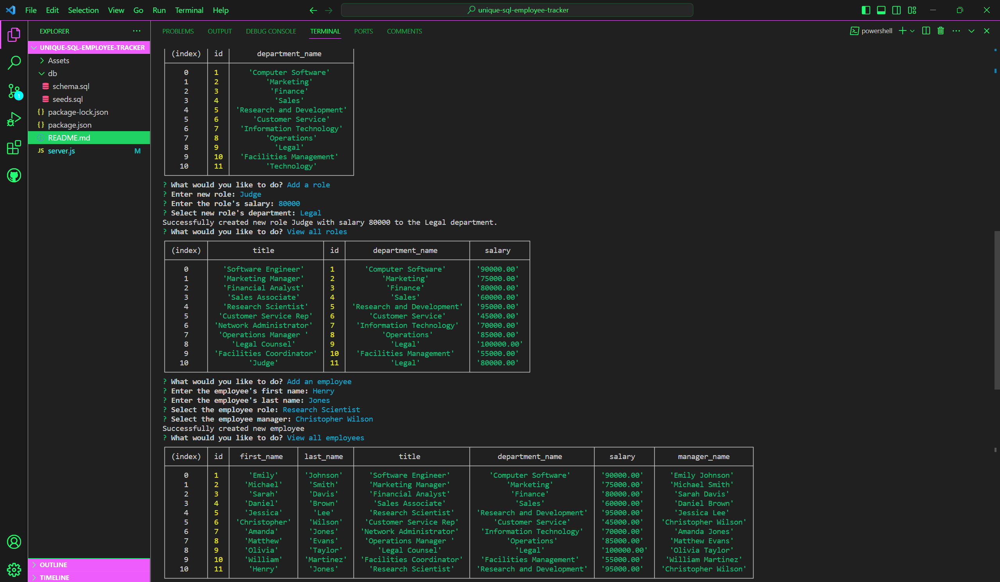

# Unique SQL Employee Tracker

## User Story

```md
AS A business owner
I WANT to be able to view and manage the departments, roles, and employees in my company
SO THAT I can organize and plan my business
```

## Acceptance Criteria

```md
GIVEN a command-line application that accepts user input
WHEN I start the application
THEN I am presented with the following options: view all departments, view all roles, view all employees, add a department, add a role, add an employee, and update an employee role
WHEN I choose to view all departments
THEN I am presented with a formatted table showing department names and department ids
WHEN I choose to view all roles
THEN I am presented with the job title, role id, the department that role belongs to, and the salary for that role
WHEN I choose to view all employees
THEN I am presented with a formatted table showing employee data, including employee ids, first names, last names, job titles, departments, salaries, and managers that the employees report to
WHEN I choose to add a department
THEN I am prompted to enter the name of the department and that department is added to the database
WHEN I choose to add a role
THEN I am prompted to enter the name, salary, and department for the role and that role is added to the database
WHEN I choose to add an employee
THEN I am prompted to enter the employee’s first name, last name, role, and manager, and that employee is added to the database
WHEN I choose to update an employee role
THEN I am prompted to select an employee to update and their new role and this information is updated in the database 
```

## Objective

Create an application using mysql2 and inquirer, where, provided with a selection of options to choose from, they will include whether to view a list of employees, view a list of roles, view a list of departments, add new employees, add new departments, add new roles, or simply update existing employee roles, where there will be an extra option to exit the application. It must be so that, when a user selects a choice, the table will be returned with department, role, or employee information (or where it is continuously updated by the user's entries, the updated table will also be returned). For a bonus, add a delete option to remove employees, departments, or roles from the database, including updating employee managers, viewing employees by manager, viewing employees by department, or viewing the total budget of any department.



## Link to Video
https://www.youtube.com/watch?v=9AJjRyGpiNw

## How to Run

1. Run 'git clone (repo link)' on Git Bash'
2. CD into project directory
3. Run project via code editor (e.g. Visual Studio Code)
4. Open the terminal
5. Run 'npm install' to download all necessary dependencies
6. Make sure to create the database (DBEmployeeTracker) and populating from seeds.sql first prior to executing application
6. Run 'npm start' and follow through the prompts to view current table entries or to have it updated